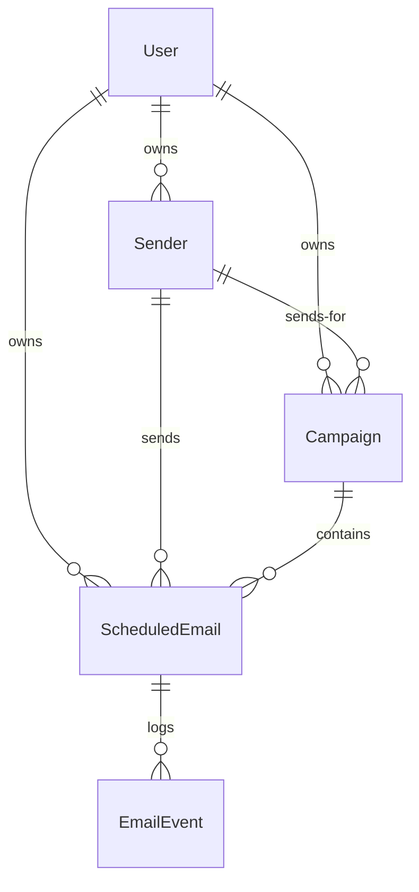
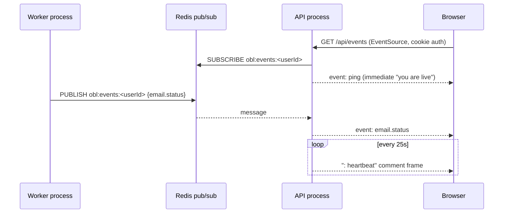

# Architecture

A component-by-component walkthrough of OutboxLab. The [README](../README.md) covers the
"what"; this covers the "why it is built this way".

---

## 1. Process topology

Three processes, deliberately separate:

| Process | Entry | Responsibility |
| --- | --- | --- |
| API | `backend/src/index.ts` | HTTP REST, SSE stream, Bull Board. **Never** processes jobs. |
| Worker | `backend/src/worker.ts` | Boot reconciliation, drift sweeper, job processing. **Never** serves HTTP. |
| Web | `frontend/` | Next.js App Router dashboard. |

Why split the API from the worker:

- A burst of 5,000 sends cannot make the dashboard unresponsive, and a slow HTTP request
  cannot delay a send.
- Workers scale horizontally and independently — run `npm run dev:worker` any number of
  times; the global queue limiter keeps total outbound volume in check.
- **The restart demo is honest.** Stopping the worker stops delivery while the API stays up,
  so you can watch rows sit in `SCHEDULED` and then drain when the worker returns.

Both processes share `config/env.ts`, which zod-validates the environment and calls
`process.exit(1)` with a readable message on failure. A misconfigured scheduler is worse
than a dead one.

---

## 2. Data model



### `ScheduledEmail` — the durable job ledger

One row per recipient. `id` doubles as the BullMQ `jobId`, which gives idempotent
re-enqueueing for free.

Key columns and why they exist:

| Column | Purpose |
| --- | --- |
| `subject`, `body` | Rendered **at schedule time**, so the exact payload is auditable and the worker does no template work on the hot path |
| `vars` (JSONB) | The per-recipient CSV columns, kept for re-rendering and debugging |
| `sendAt` | Drives the BullMQ delay; only the *stagger* is baked in, never the cap |
| `hourlyLimit` | Captured per email so a campaign stays reproducible if the mailbox's cap changes later |
| `attempts` | Genuine delivery attempts only |
| `deferredCount` | Times bumped by the rate limiter or pacer — **not** a retry |
| `previewUrl` | Ethereal proof surface |

Indexes:

- `@@unique([campaignId, to])` — re-uploading the same CSV into a campaign cannot create a
  duplicate send.
- `(status, sendAt)` — drives the reconciler and sweeper scans.
- `(senderId, status)`, `(userId, status, sendAt)`, `(campaignId, sendAt)` — dashboard reads.
- A functional GIN index over a weighted `tsvector` for search (below).

### `EmailEvent` — append-only audit trail

Every decision the engine makes is appended here *before* it is broadcast. That ordering
matters: the per-email timeline in the UI is complete even for events that happened while
nobody was watching. **The SSE stream is an accelerator, not the system of record.**

Event types: `QUEUED`, `PICKED_UP`, `DEFERRED_RATE_LIMIT`, `DEFERRED_PACING`, `SENT`,
`FAILED`, `RETRY_SCHEDULED`, `RESCHEDULED`, `CANCELLED`, `RECONCILED`.

---

## 3. Search without Elasticsearch

The migration creates a **functional** GIN index:

```sql
CREATE INDEX "scheduled_emails_search_idx" ON "scheduled_emails" USING GIN (
  setweight(to_tsvector('english', coalesce("to",      '')), 'A') ||
  setweight(to_tsvector('english', coalesce("subject", '')), 'B') ||
  setweight(to_tsvector('english', coalesce("body",    '')), 'C')
);
```

The expression is immutable (the `'english'` regconfig is a literal), which is what allows
it to be indexed directly instead of needing a stored column plus a trigger.

Weights mean a match on the address outranks one buried in the body. Queried with
`websearch_to_tsquery`, so users get quoted phrases and `-negation` for free.

> **The trap:** the SQL in `emails.service.ts` must reproduce this expression *character for
> character*. If it drifts, Postgres cannot use the index and silently falls back to a
> sequential scan. That is why the expression lives in one `Prisma.sql` constant.

Queries shorter than three characters skip tsquery entirely and use an indexed
`lower("to") LIKE 'ann%'` prefix match, because tsquery cannot usefully match a two-letter
fragment.

---

## 4. The scheduling engine

### `queue/queues.ts`

Two queues: `outboxlab-emails` and `outboxlab-maintenance`. Job payloads carry
**identifiers, not content** — the worker always re-reads the row, so a job enqueued before
an edit cannot send stale copy.

Default job options: `attempts: MAX_JOB_ATTEMPTS`, exponential backoff from 5s,
`removeOnComplete` after 24h/5000, `removeOnFail` after 7 days.

### `queue/scheduler.ts`

`enqueueEmail` / `enqueueEmailsBulk` / `rescheduleEmail` / `removeEmailJob`.

`addBulk` matters: a 5,000-recipient campaign must not mean 5,000 sequential Redis
round-trips.

### `queue/processor.ts` — the hot path

```
load row
├─ no row?          → drop (log)
├─ status SENT      → no-op (idempotent; duplicate reconciliation is normal)
├─ status CANCELLED → no-op
├─ campaign PAUSED  → moveToDelayed(+15s), park without dropping
│
├─ status = PROCESSING, append PICKED_UP
│
├─ 1. PACER: reserve slot
│      └─ future slot? → status DEFERRED, append DEFERRED_PACING,
│                        remember slot on the job, moveToDelayed(slot) + DelayedError
│
├─ 2. QUOTA: consume one unit
│      └─ over cap?    → status DEFERRED, append DEFERRED_RATE_LIMIT,
│                        forget the stale slot, moveToDelayed(windowEnd) + DelayedError
│
└─ 3. DELIVER
       ├─ ok    → status SENT + messageId + previewUrl, append SENT, maybe complete campaign
       └─ error → refund the quota slot, increment attempts,
                  status FAILED if exhausted else SCHEDULED, rethrow for backoff
```

Two subtleties worth calling out:

**The reserved slot is remembered on the job.** When a job is deferred for pacing, the
reservation is written into `job.data.reservedSlotMs`. Without this, the job would reserve a
*second*, later slot when it woke up — and drift forward forever.

**A rate-limit deferral forgets the slot.** By the time quota is checked, the pacing slot
has already elapsed, so the next pass must book a fresh one.

### `queue/worker.ts`

`DelayedError` surfaces on the `failed` event. It is normal control flow, not a failure, so
it is explicitly filtered out of error logging — otherwise a healthy throttled campaign
would fill the logs with fake errors.

---

## 5. Realtime fan-out



The worker is a separate process and cannot write to a browser's HTTP response. Redis
pub/sub bridges the gap, which also means **the API scales horizontally with no sticky
sessions** — any replica holding the browser's connection relays the payload.

Why SSE rather than WebSockets:

- Data only ever flows server → client, so a duplex protocol buys nothing while costing an
  extra handshake and a heavier client.
- It rides on plain HTTP, so the existing cookie auth and CORS setup apply unchanged — no
  separate token exchange for the socket.
- `EventSource` reconnects automatically, so a worker restart or a laptop waking from sleep
  repairs itself.

Two things that would silently break it, handled explicitly:

- **Compression buffers the stream.** `compression()` is opted out for `/api/events`.
- **Node closes idle sockets at 5 minutes.** `server.requestTimeout = 0` plus a 25s
  heartbeat.

On the client, `hooks/useLiveEvents.ts` adds a bounded backoff and a **watchdog**: the
server heartbeats every 25s, so 45s of total silence forces a reconnect rather than trusting
a half-open socket. `context/live-context.tsx` shares **one** connection across the whole
dashboard — browsers cap concurrent connections per origin, so a per-page stream would
exhaust that budget.

---

## 6. Frontend structure

```
app/
├─ page.tsx              landing (shader background, architecture diagram)
├─ login · register      zod + react-hook-form, demo prefill
└─ dashboard/
   ├─ layout.tsx         auth guard + LiveProvider + floating nav + centred column
   ├─ page.tsx           KPIs · throughput · quota rings · activity
   ├─ compose            CSV drop · template vars · live preview · forecast
   ├─ scheduled · sent   server-paginated tables + FTS + drawer
   ├─ campaigns/[id]     animated node timeline
   ├─ senders            one-click Ethereal, live quota rings
   └─ settings           Time Machine · concurrency · health
```

**Design system.** One `.liquid-glass` surface treatment (`globals.css`) is used for every
panel: saturated backdrop blur, a 1px specular ridge along the top edge, ambient light
pooling below it, and a deep soft shadow. Panels therefore read as one material rather than
a pile of ad-hoc translucent boxes. Light and dark are driven by CSS custom properties, and
the accent colour is written to `--primary` at runtime by the theme context.

**Layout.** The dashboard uses a floating centred nav dock rather than a left sidebar, so
the content column is centred in the actual viewport instead of "viewport minus 248px", and
the dashboard shares one visual language with the marketing page.

**Performance.** The WebGL shader backdrop is dimmed hard behind data tables (contrast beats
spectacle) and is replaced entirely by a static gradient under `prefers-reduced-motion` — so
the GL loop never runs for users who asked for stillness, which also keeps long table
scrolls smooth on weak GPUs.

---

## 7. Security posture

| Concern | Handling |
| --- | --- |
| Passwords | bcrypt, 12 rounds. Login compares against a dummy hash when the user does not exist, so response time does not reveal whether an email is registered |
| Sessions | JWT in an httpOnly, SameSite cookie; `secure` + `SameSite=None` when `COOKIE_SECURE=true`. Bearer header also accepted for curl/Postman |
| Token revocation | `requireAuth` hits the DB every request, so a deleted user cannot keep using a valid token |
| SMTP credentials | Never returned by the API — every read path uses an explicit column projection |
| Template injection | The renderer substitutes literal own-keys only. No logic, no property traversal, no code execution; `{{constructor}}` and `{{__proto__}}` render empty |
| HTML injection | Subject and body are HTML-escaped before being placed in the email shell |
| Credential stuffing | `express-rate-limit` on `/api/auth/*`, separate from the email rate limiter |
| CORS | Explicit origin allowlist (credentialed requests cannot use a wildcard) |
| Headers | `helmet`, `x-powered-by` disabled |
| Queue inspector | Basic auth — it can mutate the queue |
| Logs | pino `redact` strips `password`, `passwordHash`, `smtpPassword`, cookies, auth headers |

---

## 8. Failure modes and responses

| Failure | Response |
| --- | --- |
| Worker killed mid-send | Row stuck in `PROCESSING` → boot reconciler resets it to `SCHEDULED` and re-enqueues |
| Redis flushed while running | Drift sweeper detects Postgres rows with no job within 60s and restores them |
| Redis wiped + restart | Boot reconciler rebuilds the entire queue from Postgres |
| Postgres down at boot | API logs a fatal message naming the fix and exits 1 |
| Redis hiccup reading the window | `getRateWindowMs` falls back to the env default; scheduling never breaks |
| SMTP flapping | Quota slot refunded, exponential backoff, `FAILED` after `MAX_JOB_ATTEMPTS` with `lastError` |
| Duplicate job delivery | Status guard makes it a no-op |
| pub/sub publish fails | Logged and swallowed — realtime is a convenience layer and must never break a send |
| Malformed SSE frame | Discarded; the heartbeat keeps the connection healthy |
